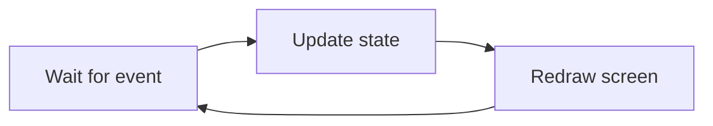
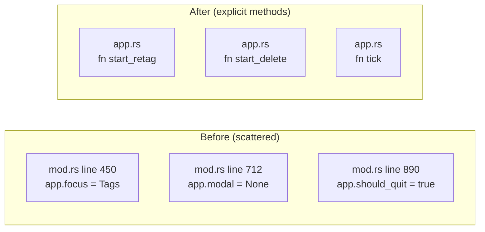
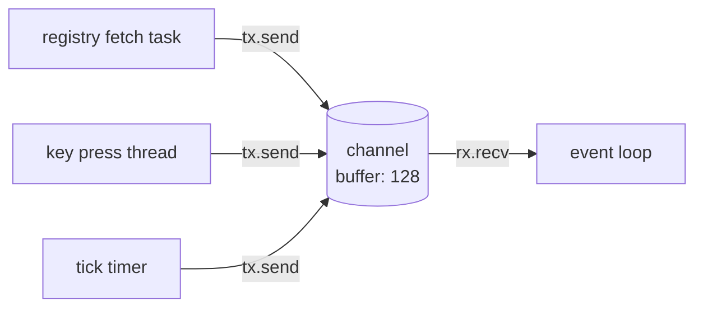
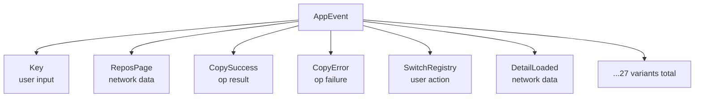
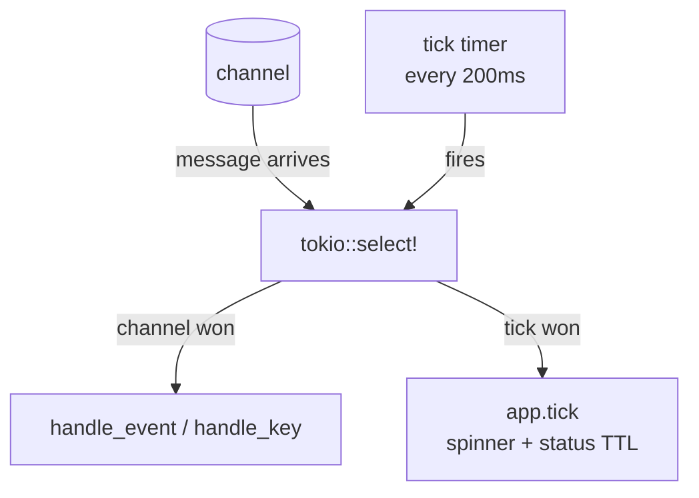
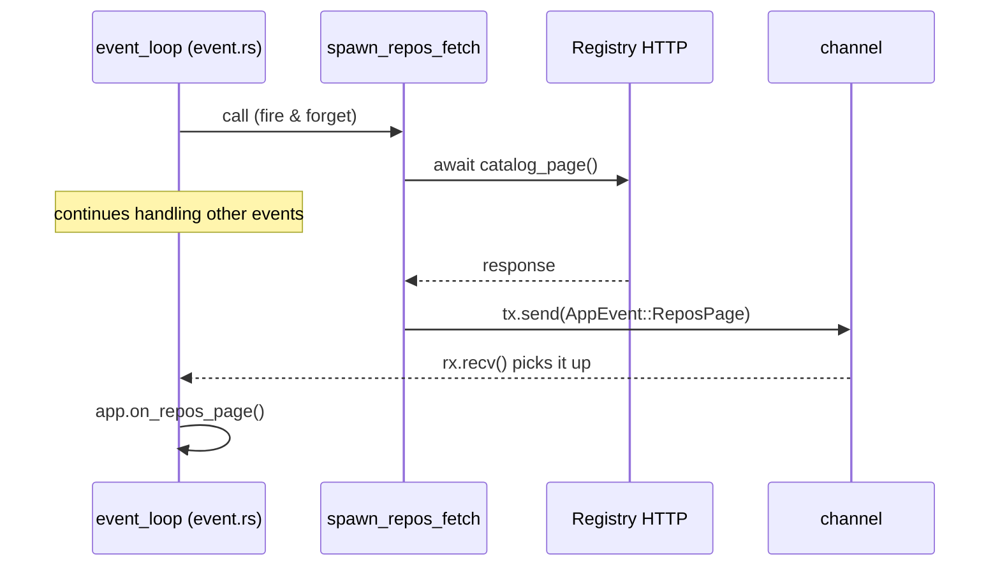
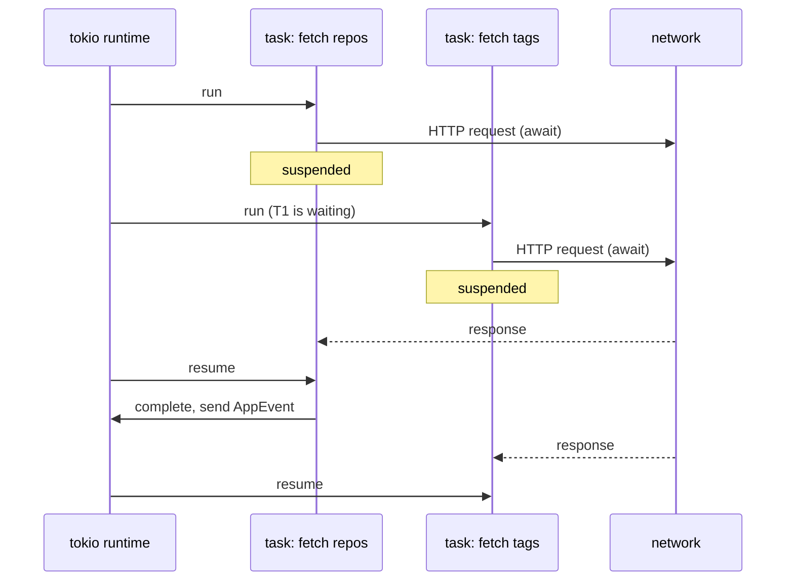
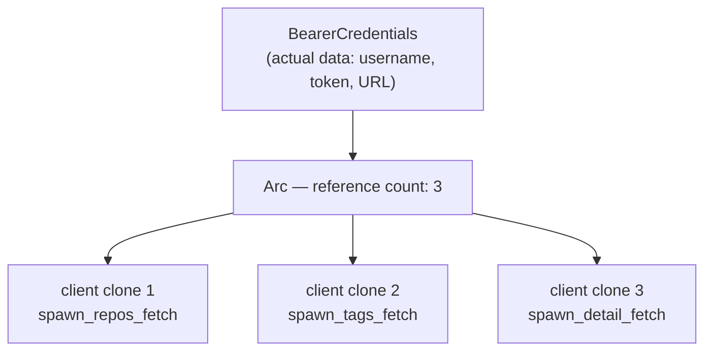
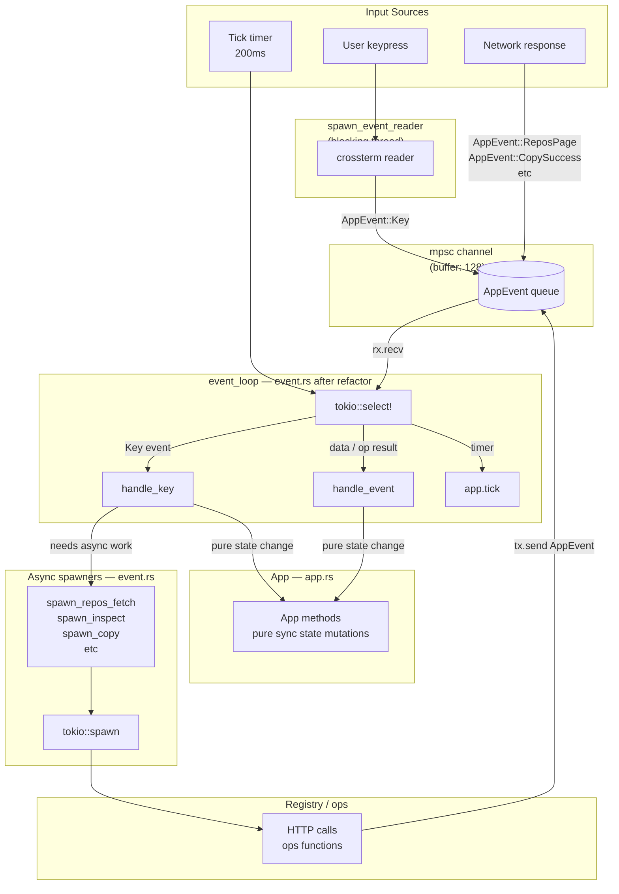

# Rust Concepts: TUI Refactor Edition

For SRE engineers who know systems but are new to Rust async patterns.

---

## Big Picture

Current `tui/mod.rs` is one giant loop:

1. Wait for input (key press or network result)
2. Update in-memory state
3. Redraw screen
4. Repeat

SRE analogy: Kubernetes controller reconcile loop. Watch for events → mutate state → reconcile → repeat.



---

## Concept 1: State Mutations

**What**: Changing fields on a struct in memory.

```rust
app.focus = Focus::Tags;    // change which panel is active
app.should_quit = true;     // tell loop to exit
app.modal = Modal::None;    // close popup
```

`App` struct = service runtime state. Like `/proc/sys/` values or a Prometheus gauge — holds current truth. Mutations = writes to that state.

**Why it matters**: Currently mutations happen scattered inside 1113-line file. Goal = all mutations go through explicit `App` methods so they can be tested without running the whole app.



---

## Concept 2: Channels (`mpsc`)

`mpsc` = **m**ulti-**p**roducer **s**ingle-**c**onsumer.

SRE analogy: **message queue** (SQS, Kafka topic) but in-process. Many senders, one receiver.

```rust
let (tx, mut rx) = mpsc::channel::<AppEvent>(128);
//    ^sender      ^receiver                  ^buffer size (128 messages)
```

`tx` (transmitter) = write end. Gets cloned and given to each background task.
`rx` (receiver) = read end. Stays in event loop. One reader only.



Why this pattern vs direct function call: background tasks run concurrently, finish at unknown times. Channel decouples "task finished" from "loop ready to handle it."

---

## Concept 3: `AppEvent` Enum

Enum = tagged union. One type that holds many different shapes of data.

```rust
enum AppEvent {
    Key(KeyEvent),                  // user pressed a key
    ReposPage(Vec<String>, bool),   // registry returned repos
    CopySuccess { dest: String },   // copy op finished OK
    CopyError(String),              // copy op failed
    // ... 27 more variants
}
```

SRE analogy: **event types** in an alerting system. One event bus, many event schemas. Downstream handler decides what to do with each type.



---

## Concept 4: `tokio::select!`

Waits on multiple async sources simultaneously. Handles whichever arrives first.

```rust
tokio::select! {
    biased;
    Some(ev) = rx.recv()  => { /* handle channel event */ }
    _ = tick.tick()       => { app.tick(); }
}
```

SRE analogy: `epoll` / `select()` syscall. Instead of blocking on one socket, wait on N — handle first one ready. Foundation of event-driven servers (nginx, Node.js, etc.).

`biased` = check channel before tick. Prevents tick from starving when many events arrive fast.



---

## Concept 5: `tokio::spawn`

Launches async work in background. Returns immediately. Work runs concurrently.

```rust
fn spawn_repos_fetch(client: RegistryClient, tx: mpsc::Sender<AppEvent>) {
    tokio::spawn(async move {
        let result = client.catalog_page(100, None).await;  // network call
        let _ = tx.send(AppEvent::ReposPage(...)).await;    // send result back
    });
}
```

SRE analogy: `kubectl apply` triggering a controller to do work async. You fire and forget. Controller sends back a status event when done.

`async move` = closure captures its variables by value (takes ownership), body can use `await`.

**Rule after refactor**: `tokio::spawn` calls live ONLY in `event.rs`. `App` methods never spawn. `App` is pure state.



---

## Concept 6: `async` / `await`

Async = "this function can be paused while waiting for I/O, and runtime does other work meanwhile."

SRE analogy: nginx async I/O vs Apache thread-per-request.

| Model | Concurrency | Blocking |
|-------|-------------|---------|
| Apache (sync) | 1 thread per request | Thread blocks on I/O |
| nginx (async) | 1 thread, many connections | Suspend on I/O, serve others |
| tokio (Rust async) | Few threads, many tasks | `await` suspends, runtime switches |

```rust
let result = client.catalog_page(100, None).await;
//                                              ^
//         "suspend here. runtime runs other tasks. resume when network responds."
```



---

## Concept 7: `Arc<dyn Credentials>`

Two parts:

**`Arc<T>`** = **A**tomic **R**eference **C**ounting. Shared ownership across threads.

SRE analogy: shared config loaded once at startup, referenced by many goroutines. `Arc` = thread-safe shared pointer. When last reference drops, memory freed automatically.

**`dyn Credentials`** = trait object. "Any type that implements the `Credentials` interface." Like an interface in Go/Java.

```rust
// RegistryClient holds: Arc<dyn Credentials>
// Cloning client just increments reference count — doesn't copy credentials
let client2 = client.clone();  // cheap: just bumps a counter
```



---

## How They All Connect

Full data flow in the running application:



---

## After the Refactor: File Responsibilities

```mermaid
flowchart LR
    subgraph modrs["tui/mod.rs — ≤80 lines"]
        RUN["run()\nterminal setup\ncall event_loop\nteardown"]
    end

    subgraph eventrs["tui/event.rs — ~700 lines"]
        EL[event_loop\ntokio::select!]
        HK2[handle_key\nhandle_event\nhandle_* helpers]
        SP2[spawn_* functions\ntokio::spawn calls]
        MCP[make_client_for_profile]
    end

    subgraph apprs["tui/app.rs — ~680 lines"]
        STATE[App struct\nall state fields]
        METHODS[App methods\npure sync mutations]
        TESTS["#[cfg(test)]\n12+ unit tests"]
    end

    subgraph uirs["tui/ui.rs — unchanged"]
        DRAW[draw()\npure render]
    end

    RUN -->|calls| EL
    EL -->|calls| HK2
    EL -->|calls| SP2
    HK2 -->|mutates| METHODS
    DRAW -->|reads| STATE
```

---

## Terms Summary

| Term | What | SRE Analogy |
|------|------|-------------|
| State mutation | Write to struct field | Write Prometheus gauge |
| `mpsc` channel | In-process message queue | SQS / Kafka (in RAM) |
| `AppEvent` enum | Tagged message type | Alert event schema |
| `tokio::select!` | Wait on multiple async sources | `epoll` / event multiplexing |
| `tokio::spawn` | Launch concurrent async task | Fire goroutine / background job |
| `async/await` | Non-blocking I/O | nginx event model |
| `Arc<T>` | Thread-safe shared pointer | Shared config reference |
| `dyn Trait` | Runtime polymorphism | Interface / duck typing |

**Start with channels + `select!`** — those two explain 80% of the event loop structure.
